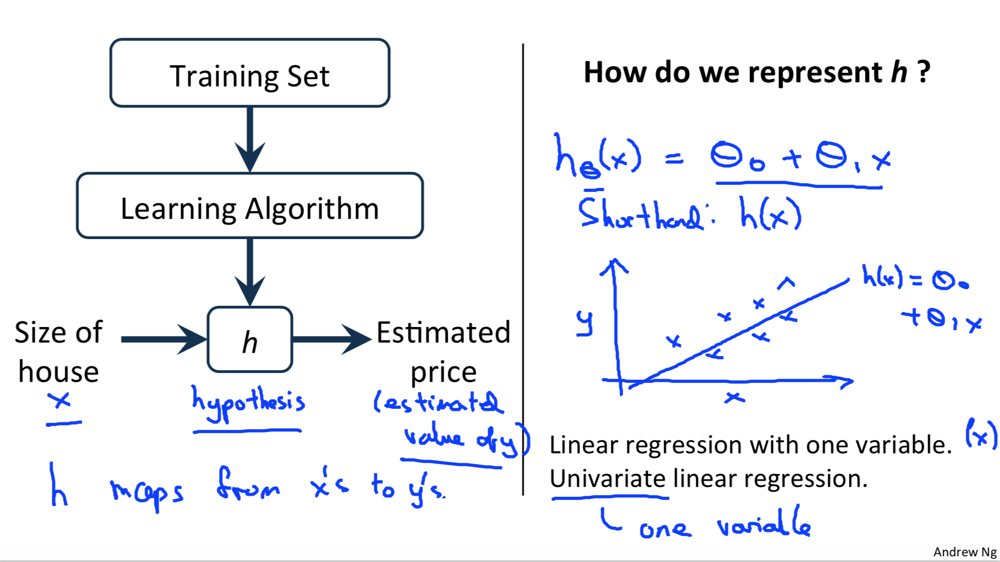

# Week 1 
## Lecture 2  Linear Regression with one variable
-----------------------------------------

### 2.1 Model Representation

**Supervised Learning** : Given the "right answer" for each example in the data.

**Regression Problem** : Predict *real-valued* output.

**Classification** : Predict *discrete-valued* output.

Notation:

- m = number of training examples
- x's = 'input' variable/features
- y's = 'output' variable/target variable
- (x,y) = one training example
- (x(i),y(i)) = ith training example

- hypothesis: \\( h\theta(x) = \theta_0 + \theta\_1x \\) , h maps from x's to y's

### 2.2 Cost Function

idea: choose \\(\theta_0\\),\\(\theta_1\\) so that \\(h\theta(x)\\) is close to y for our training examples(x,y)

### 2.3 Gradient Descent Algorithm
#### 2.3.1 定义

####2.3.2 梯度和学习率

- gradient(梯度）:  \\(\frac{\partial}{\partial\theta_0}J(\theta\_0\theta\_1)\\)
- 需要同时改变\\(\theta\_0\theta\_1\\)(simultaneously)
- α(学习率): learning rate。α会影响梯度下降的幅度。
 - 如果α太小, θ的值每次会变化的很小，那么梯度下降就会非常慢。
 - 如果α过大，θ的值每次会变化会很大，有可能直接越过最低点，可能导致永远没法到达最低点。

- 由于随着越来越接近最低点, 相应的梯度(绝对值)也会逐渐减小，所以每次下降程度就会越来越小, 我们并不需要减小α的值来减小下降程度。
- 

####2.3.3计算梯度
梯度也就是代价函数对每个θ的偏导。计算如下：

**用于线性回归的代价函数总是一个凸函数(Convex Function，bowl-shaped）。这样的函数没有局部最优解，只有一个全局最优解。所以我们在使用梯度下降的时候，总会得到一个全局最优解。*

####notes:
