

# Week 2 
## Lecture 4  Linear Regression with Multiple Variables 
-----------------------------------------

### 4.1 Model Representation

Notation:

- n = number of features
- \\(x^{(i)}\\) = 'input' features of \\(i^{th}\\) training example
- \\(x_j^{(i)}\\) = value of feature j in \\(i^{th}\\) training example

- hypothesis: \\( h\theta(x) = \theta_0x\_0 + \theta\_1x\_1+\theta\_2x\_2+ ... + \theta\_nx\_n \\) , h maps from x's to y's
 - (for convenience of notation, define \\(x_{0} = 1\\))
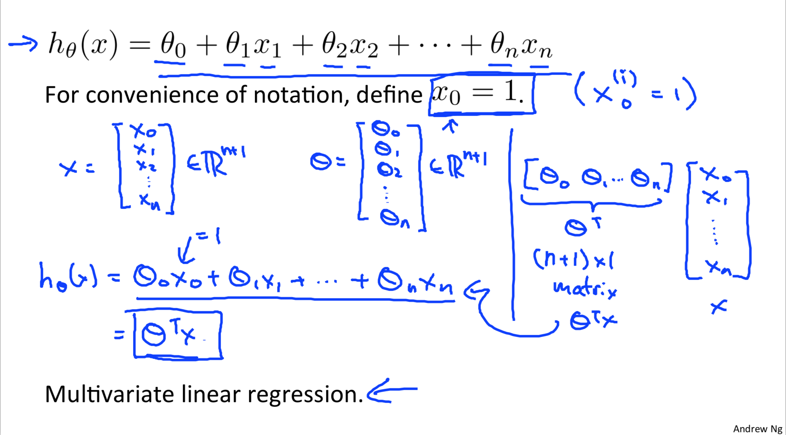

***注意上面的系数，因为\\(\Theta\\)有n+1，为了方便增加了x0，所以\\( x \in \mathbb{R}^{(n+1)}\\)**

***默认\\(\Theta\\)是行向量，所以用\\( h\theta(x) = \theta^Tx\\)**

### 4.2 Gradient Descent Algorithm

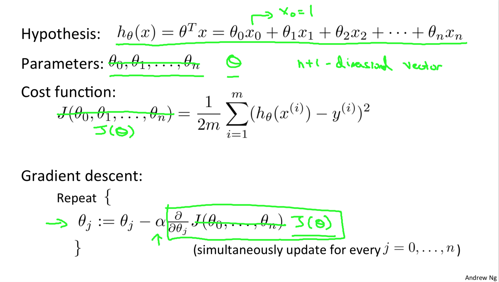
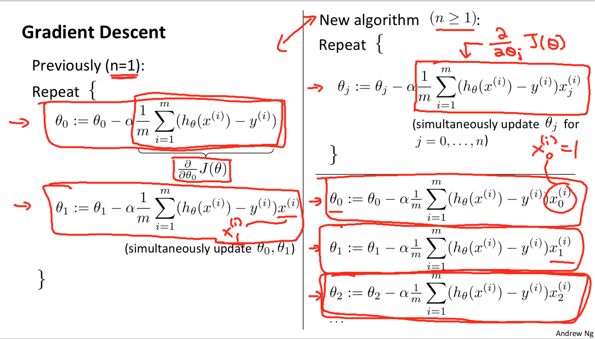

### 4.3 Feature Scaling
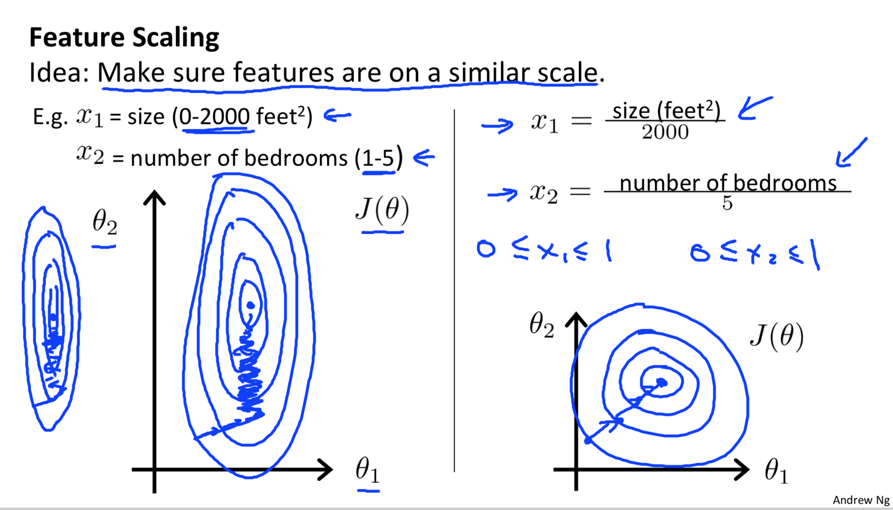
通常我们需要把特征都缩放到[-1,1](附近)这个范围.
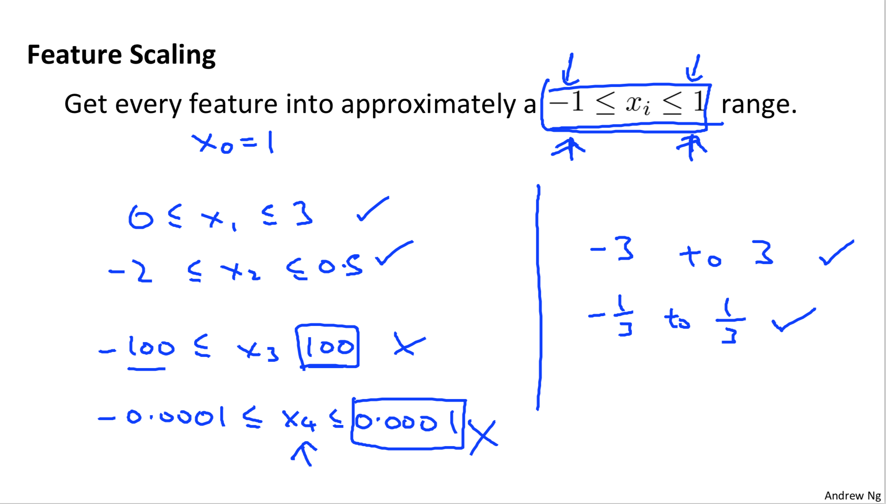
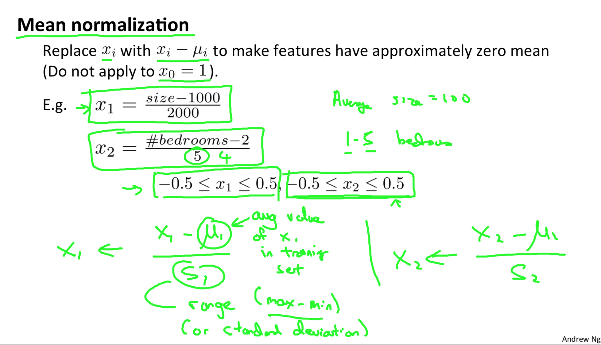

### 4.4 Learning Rate
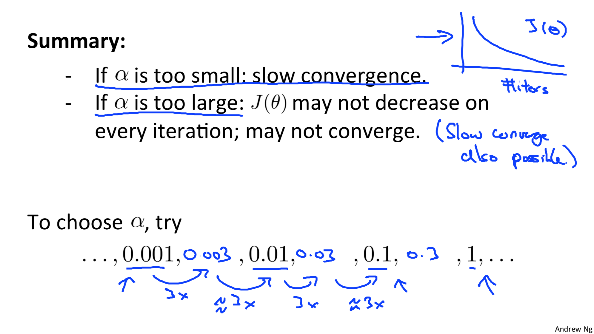

### 4.5 Polynomial Regression(多项式回归)

### 4.6 Normal Equation（正规方程）
另一种求解能够minJ的\\(\theta\\)值的方法：normal equation。

- 推理过程：
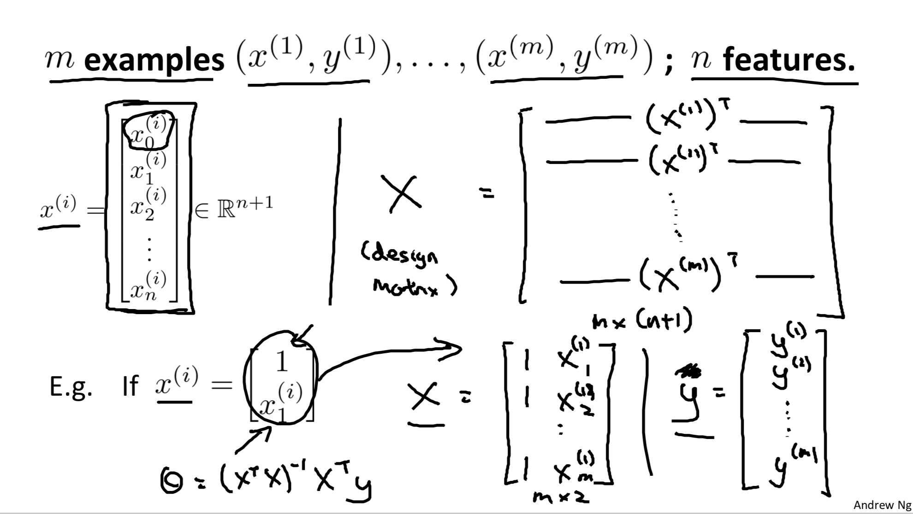
- 公式：
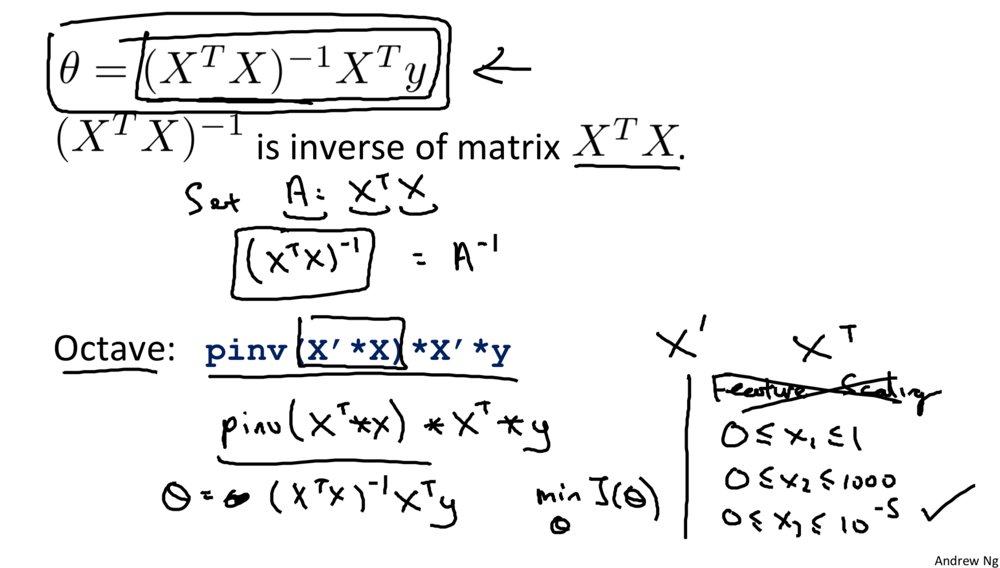
- 对比Normal Equation和Gradient Descent
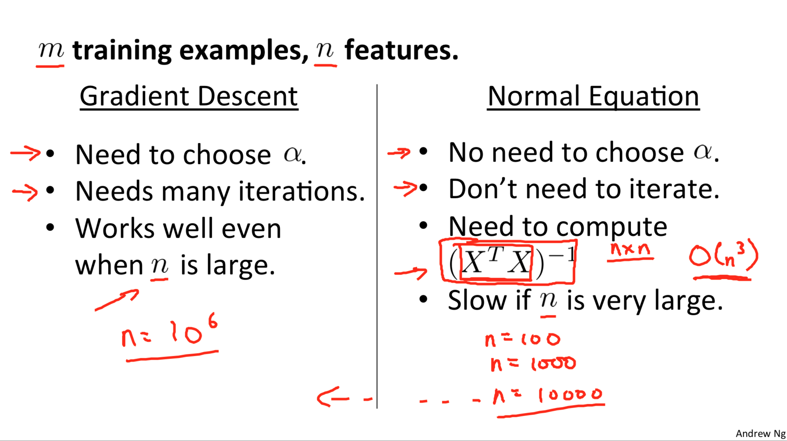
- 正规方程不可逆的情况：使用了冗余的特征，或者，太多的特征（超过样本数）。那么需要处理特征：删掉/正则化。
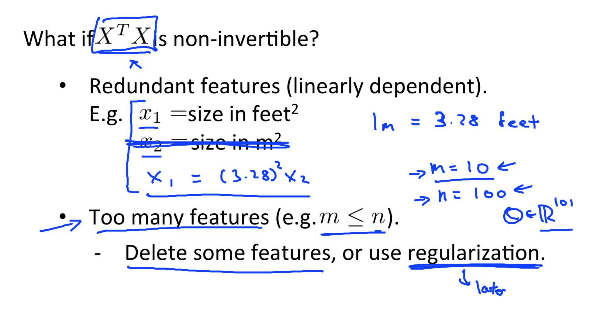