

# Week 7 
## Lecture 12  Support Vector Machines（支持向量机）
-----------------------------------------

### 12.1. Optimization Objective(优化目标)

**Support Vector Machine(SVM)**是一种广泛运用的算法，中文一般翻译成：支持向量机。这里介绍的只是最基础的知识。这个名称也是很怪，其实是这样来的：（Support Vectors: Input vectors that just touch the boundary of the margin.）后面会看到。

为了描述SVM，从逻辑回归开始展示我们如何修改得到SVM。

#### 12.1.1. 逻辑函数的假设函数

上面左边是逻辑回归中的假设函数形式，右边是S型激励函数。为了解释一些数学知识, 用\\(z\\) 表示\\(\theta^Tx\\)。

逻辑回归：

如果有一个\\(y=1\\)的样本(不管是在训练集或测试集或交叉验证集中)，总之是\\(y=1\\)，那么，如果想要正确地将此样本分类，就意味着 \\(h\_\theta(x)\\)趋近于1，对应  \\(z = \theta^Tx\\) 远大于0。

相反地，如果我们有另一个样本，即\\(y=0\\)。则希望假设函数的输出值\\(h\_\theta(x)\\)趋近于0，对应 \\(z = \theta^Tx\\) 远小于0。

#### 12.1.2. 逻辑函数的Cost Function
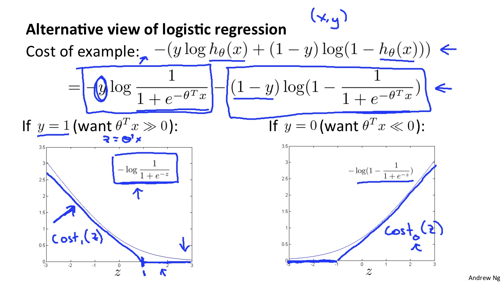

当\\(y=1\\)的时候, 我们可以将式子的前半部分看成关于z的函数, 并将它描绘出来, 如下图左下细线所示. 如果我们将这个图形稍改变一下变成蓝色线的样子, 这个就是SVM的cost term。 当\\(y=0\\)的时候, 类似。
我们把左边的叫做\\(cost\_1(z)\\), 右边的叫\\(cost\_0(z)\\)。

#### 12.1.3. SVM的Cost Function

上图中，将logistic regression中的两个部分用\\(cost\_1(z)\\)和\\(cost\_0(z)\\)替换, 并且去掉常数项m。最后再去掉λ，并加上常数项C, 这样我们就得到了SVM的cost function。

上图中，是SVM的假设函数。

注意点：

- 有别于逻辑回归。当最小化代价函数，获得参数\\(\theta\\)时，SVM所做的是用它来直接预测y的值等于1还是0。——这是SVM数学上的定义。

### 12.2. Large Margin Intuition(最大间隔的直观理解)

####12.2.1. 将SVM看作是最大间隔分类器。

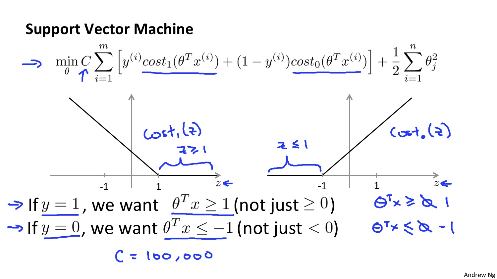

上图：在SVM中, 当y＝1的时候, 我们希望\\(z = \theta^Tx \ge 1\\)而不是\\(z = \theta^Tx \ge 0\\)；当y＝0的时候, 我们希望\\(z = \theta^Tx \le -1\\)
而不是\\(z = \theta^Tx \le 0\\)。

支持向量机的要求更高，不仅仅要能正确分开输入的样本，即不仅仅要求\\(z = \theta^Tx \ge 0\\)，我们需要的是比0值大很多，比如大于等于1，反之亦然。
——**这就相当于在支持向量机中嵌入了一个额外的安全因子，或者说安全的间距因子**。

####12.2.2 如果C很大？
现在假设C是一个非常大的数例如100,000, 我们看看SVM会有什么结果. 在C非常大的情况下, 我们想要最小化代价函数, 那么就得有第一项为0. 而想要第一项为0, 我们需要保证当y＝1的时候, \\(z = \theta^Tx \ge 1\\)；或者，当y＝0的时候, \\(z = \theta^Tx \le -1\\)。在此约束下, 我们的优化问题就变成了(下图右下角)：

####12.2.3 SVM Decision Boundary
在解决上述优化问题时(暂时先不考虑如何解决的), 我们会发现, SVM会选择一个具有最大间隔的decision boundary。如下图中的黑线所示, 而不是绿线或者粉线.

- 但是当出现异常点的时候, decision boundary会变成下图所示的粉色线. 但是如果C不是非常大的话, 在有异常点的情况下我们还是会得到大概黑色线所示的decision boundary.
- 如果数据集不是线性可分的, SVM也可以恰当的将它们分开。
如下图：

回顾 \\(C=1/\lambda\\)，因此：

C 较大时，相当于 λ 较小，可能会导致过拟合，高方差。

C 较小时，相当于λ 较大，可能会导致低拟合，高偏差。

### 12.3 最大间距的数学原理（选修）

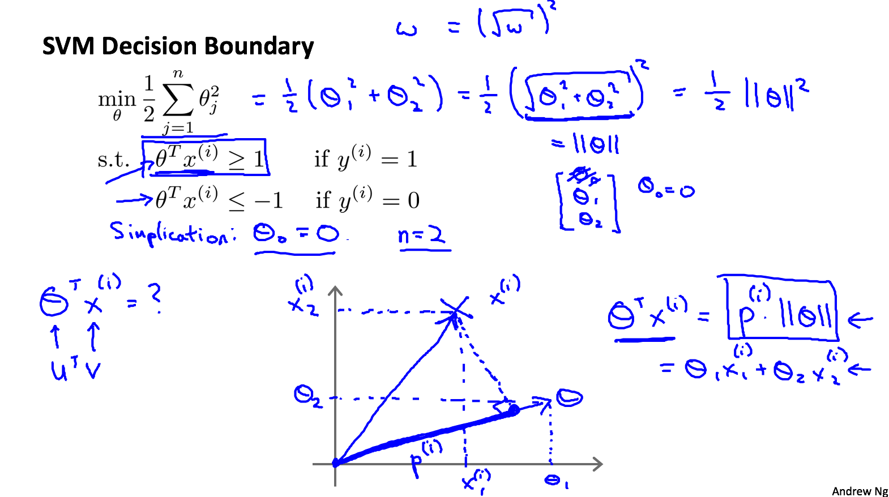
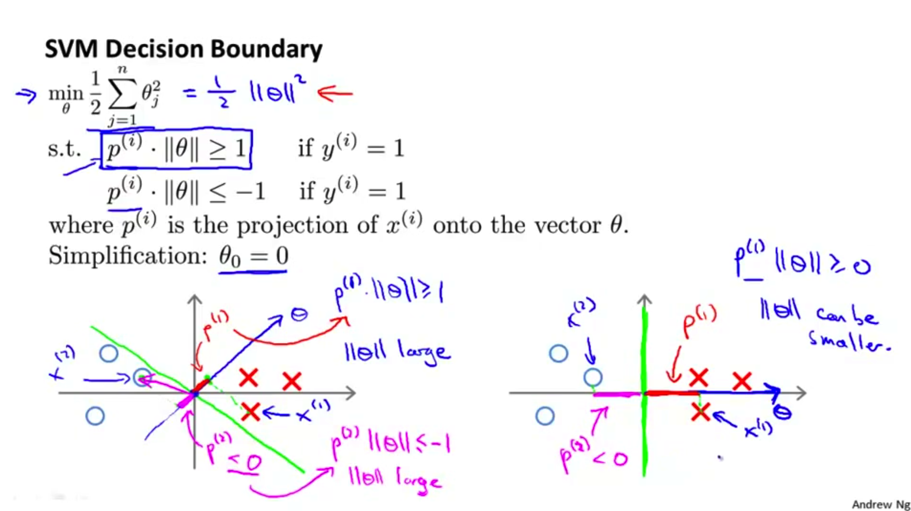

### 12.4 核函数（Kernal）

假设我们有一个如下图所示训练集, 我们希望拟合一个非线性的决策边界. 我们可以构造一个多项式。使用f来代替多项式中的特征变量, 如下图蓝色字所示.（即：可以使用高级数的多项式模型来解决无法用直线进行分隔的分类问题。）
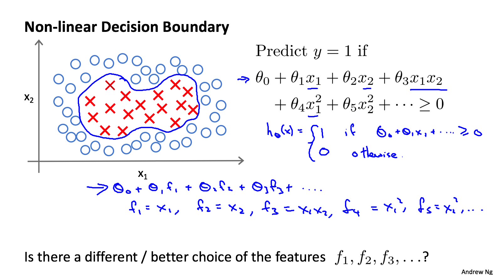

- 问题：我们不知道这些新特征f是否合适。除了对原特征进行组合以外，有没有更好的方法来构造f1,f2,f3？

- 答案：我们可以利用核函数来计算出新特征。给定一个训练样本X，我们利用X的各个特征与我们预先选定的**地标**(**landmarks**)  l1,l2,l3的近似程度来选取新特征f1,f2,f3。

####12.4.1. 构造f1, f2, f3的方法. 
如下图所示, 人工选择三个不同的点,用l(1), l(2), l(3)来表示. 定义f1, f2, f3如下：

以l1为例, 当x离l1很近很近的时候f1≈1；当x离l1较远的时候f1≈0.
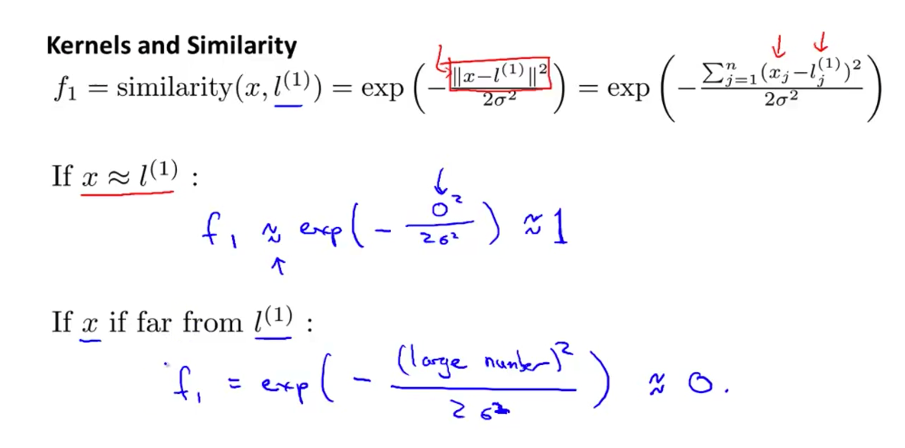

把f1看成是关于x的函数, 这样描绘出f1的图形如下图所示. 图中也可以看出，当x离l1很近的时候，f1≈1。当σ的值发生变化时, f1的图形有规律的变化.
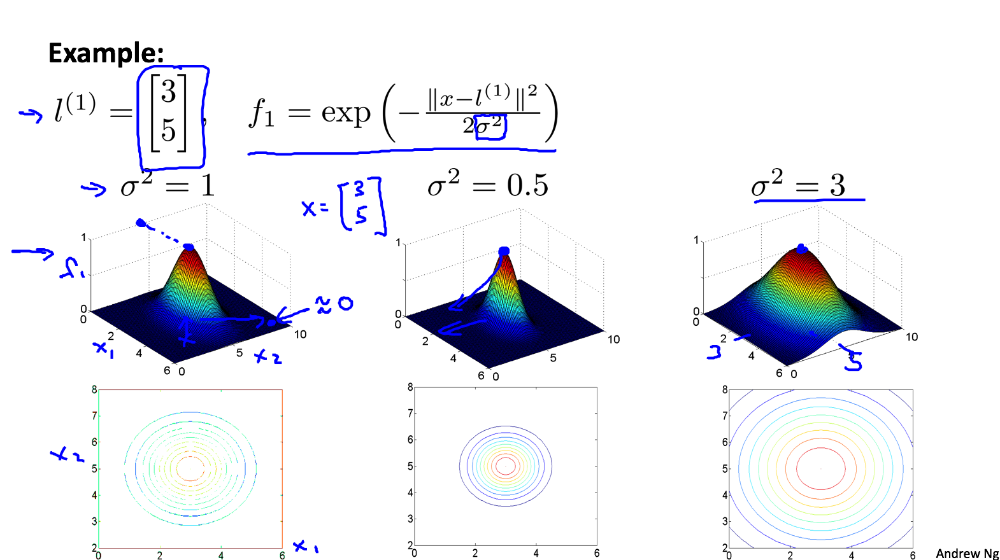

假设我们现在已经训练出θ0=−0.5, θ1=1, θ2=1, θ3=0. 当x在l(1)附近时, 计算可知应该预测y=1. 当x离的都比较远的时候（如下图所示）, 计算可知应该预测y=0.如下图所示.
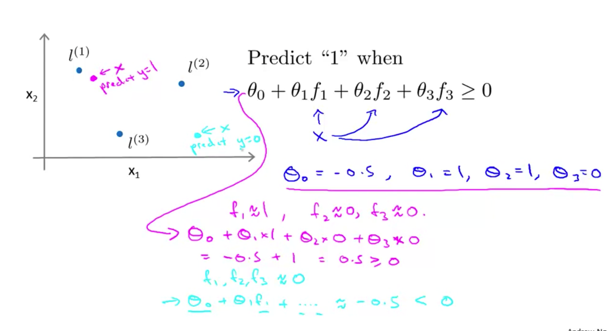

当x在l(1)或l(2)附近时, 都应该预测y=1. 所以决策边界如下图所示：

####12.4.2. 如何选取l?
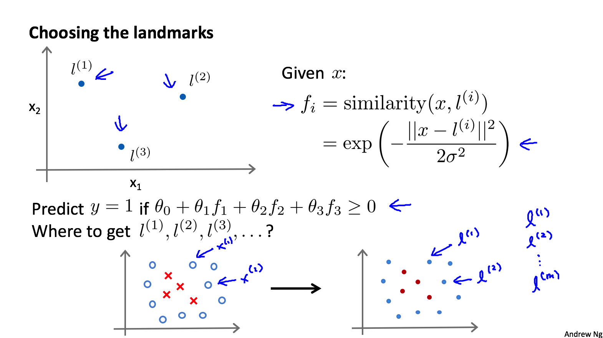
假设给定m个训练样例, 我们直接将这些点作为l(1),l(2), … , l(m). 其中，上面右边这个similarity(x,l(i))就是核函数。\\(|x-l^{(i)}|^2 =\sum\_{j=1}^n (x\_j - l\_j)^2\\)，为实例X中所有特征与地标l之间的距离的和。这样做的好处在于：现在我们得到的新特征是建立在原有特征与训练集中所有其他特征之间距离的基础之上的.

#### 12.4.3. SVM with Kernals
给定一个训练样例x(i), 我们需要计算出所有的f(i)1, f(i)2, … , f(i)m.

最后我们通过如下训练来得到最优的θ.

理论上讲，我们也可以在逻辑回归中使用核函数，但是上面使用M来简化计算的方法不适用与逻辑回归，因此计算将非常耗费时间。

- 在此，不介绍最小化支持向量机的代价函数的方法，你可以使用现有的软件包（如**liblinear**,**libsvm**等）。
    - 在使用这些软件包最小化我们的代价函数之前，我们通常需要编写核函数，并且如果我们使用高斯核函数，那么在使用之前进行**特征缩放**是非常必要的。

- 另外，支持向量机也可以不使用核函数，不使用核函数又称为**线性核函数**(**linear kernel**)，当我们不采用非常复杂的函数，或者我们的训练集特征非常多而样本非常少的时候，可以采用这种不带核函数的支持向量机。

#### 12.4.4. SVM的两个参数C和σ值对于bias和variance的影响

\\(C=1/\lambda\\)

C 较大时，相当于λ 较小，可能会导致过拟合，高方差；

C 较小时，相当于λ 较大，可能会导致低拟合，高偏差；

σ 较大时，可能会导致低方差，高偏差；

σ 较小时，可能会导致低偏差，高方差。

### 12.5 使用SVM

- 不建议自己写软件来求解参数\\(\theta\\)。用以解决**SVM**最优化问题的软件很复杂，且已经有研究者做了很多年数值优化了。因此强烈建议使用高优化软件库中的一个，而不是尝试做。有许多好的软件库，用得最多的两个是**liblinear**和**libsvm**。

#### 12.5.1.使用SVM需要选择合适的参数.

#### 12.5.2. 在使用Gaussian核函数之前需要进行feature scaling.

#### 12.5.3. 其他核函数
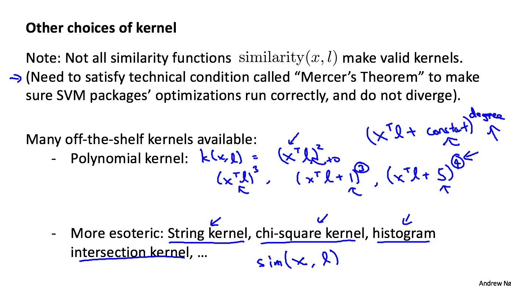

- 在高斯核函数之外我们还有其他一些选择，如：多项式核函数（Polynomial Kernel）,字符串核函数（String kernel）,卡方核函数（ chi-square kernel）,直方图交集核函数（histogram intersection kernel）,等等...

- 这些核函数的目标也都是根据训练集和地标之间的距离来构建新特征，这些核函数需要满足Mercer's定理，才能被支持向量机的优化软件正确处理。

#### 12.5.4. 多类分类问题

假设我们利用之前介绍的一对多方法来解决一个多类分类问题。如果一共有k个类，则我们需要k个模型，以及k个参数向量\\(\theta\\)。我们同样也可以训练$k$个支持向量机来解决多类分类问题。但是大多数支持向量机软件包都有内置的多类分类功能，我们只要直接使用即可。

#### 12.5.5. SVM和Logistic Regression对比
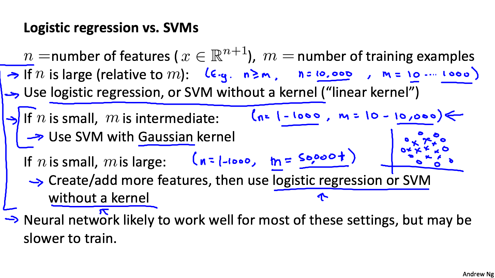

从逻辑回归模型，我们得到了支持向量机模型，在两者之间，我们应该如何选择呢？

**下面是一些普遍使用的准则：**

n为特征数，m为训练样本数。

(1)如果相较于m而言，n要大许多，即训练集数据量不够支持我们训练一个复杂的非线性模型，我们选用逻辑回归模型或者不带核函数的支持向量机。

(2)如果n较小，而且m大小中等，例如n在 1-1000 之间，而m在10-10000之间，使用高斯核函数的支持向量机。

(3)如果n较小，而m较大，例如n在1-1000之间，而m大于50000，则使用SVM会非常慢，解决方案是创造、增加更多的特征，然后使用逻辑回归或不带核函数的SVM。

值得一提的是，神经网络在以上三种情况下都可能会有较好的表现，但是训练神经网络可能非常慢，选择SVM的原因主要在于它的代价函数是**凸函数**，不存在局部最小值。
