

# Week 8 
## Lecture 13  Clustering(聚类)
-----------------------------------------

### 13.1. introduction

- supervised learning: label y, training set:\\({(x^{(1)},y^{(1)})(x^{(2)},y^{(2)}),...,(x^{(m)},y^{(m)})}\\)
- unsupervised learning: no label y, training set: \\({x^{(1)},x^{(2)}......x^{(m)}}\\)

**Application of clustering**

- Market segmentation
- Social network analysis
- Organize computing clusters
- Astronomical data analysis

###13.2. K-means algorithm
####13.2.1.通用描述.
输入为K和数据集, 注意这里不再需要添加x0=1这一项.

（1）首先随机初始化K个 cluster centroid, 记作μK.

（2）Cluster assignment: 遍历所数据, 若第i个数据离第k个cluster centroid最近, 则记为：c(i)=k.

（3）Movecentroid: 将第k个簇的均值赋值给μk.

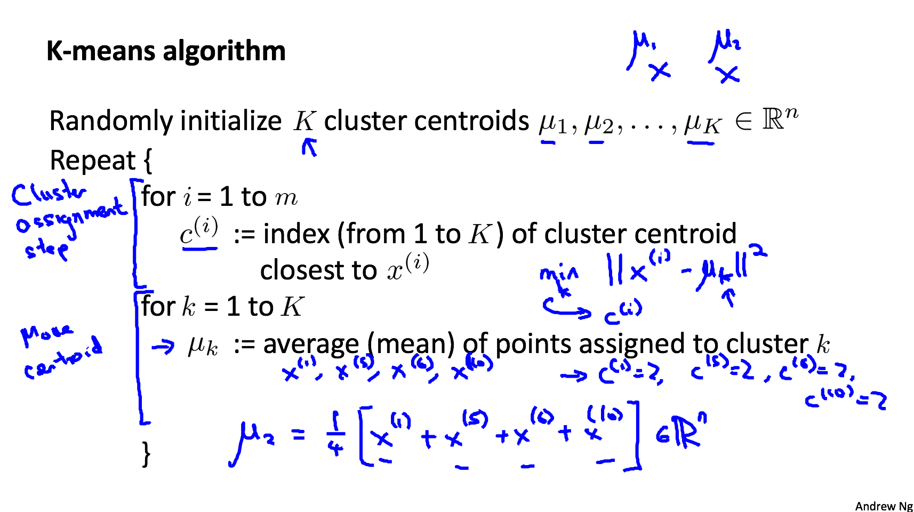

*对于没有明显区分的数据也可以用k-means算法。
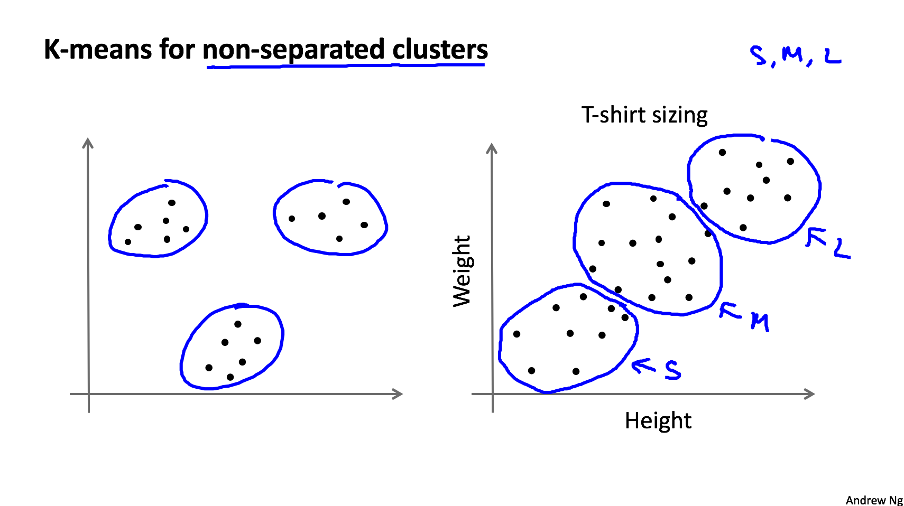

####13.2.2. Cost Function

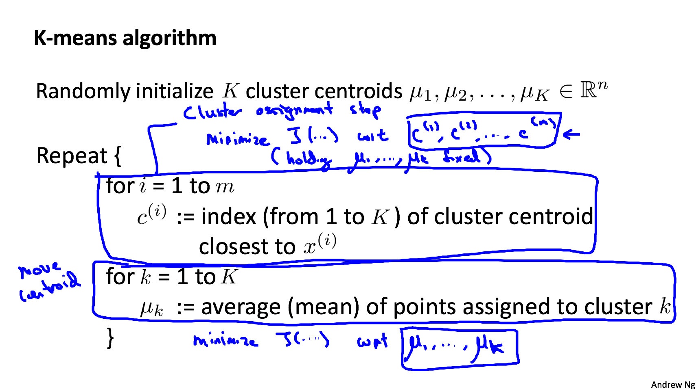

####13.2.3. Random initialization
下图说明了该如何随机地选取cluster centroid.
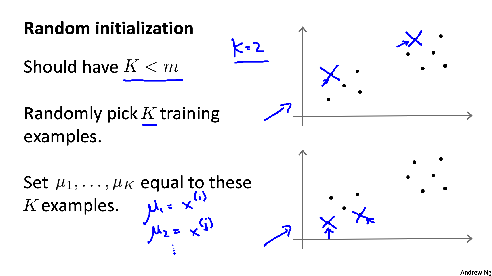
下图说明了该如何随机地选取cluster centroid.

为了解决上述问题, 我们需要随机初始化多次, 然后计算出每次J的值, 最后得到一个更好的最优解.
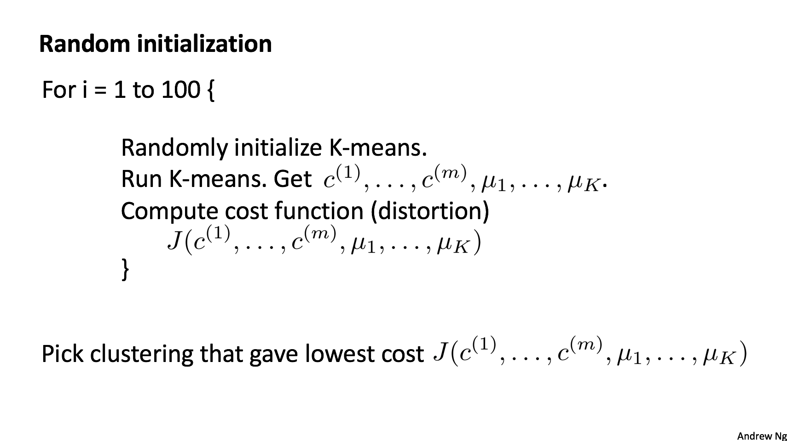

####13.2.4. What is the right value of K?

**方法1**

我们使用Elbow method, 即描绘出J关于K的图像, 然后找到”elbow”的位置, 这个位置对应的点就是应该选择的簇数. 如下左图所示. 但是, 我们经常会的到如下右图所示的样子, 它没有一个明显的”elbow”, 这样选择就比较困难了.

**方法2**

另一种选择K的方法, 就是根据我们特定的目标去选. 例如, 在给T恤标尺码的时候, 如果我们想要分成三个尺码S, M, L, 那么我们就应该选择K＝3；如果我们想要分成5个尺码XS, S, M, L, XL那么我们就应该选择K＝5.
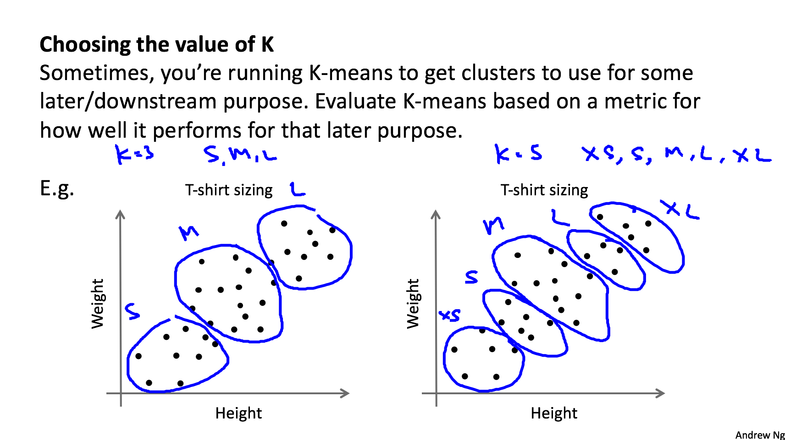

## Lecture 14  Dimensionality Reduction(降维)
-----------------------------------------

###14.1. Motivation(降维的动机)

####14.1.1. Data Compression(数据降维)
好处：节省空间；让学习算法运行得更快。

####14.1.2. Data Visualization
让数据可视化。

###14.2. PCA(Principal components analysis 主成分分析)
####14.2.1. PCA formulation
PCA就是找到一条直线，使得每个样本到这条直线的投影距离（投影误差）最小。

**区别线性回归和PCA。它们是完全不同的算法。**

在线性回归中(下左图), 我们想要的是能够拟合数据的一条直线, 最小化的是两点之间y的差；而在PCA中我们最小化的是点到直线的距离(注意下右图中点垂直于线的距离)。并且, 在线性回归中, 有一个label y；而在PCA中所有的都是特征x1,x2,....
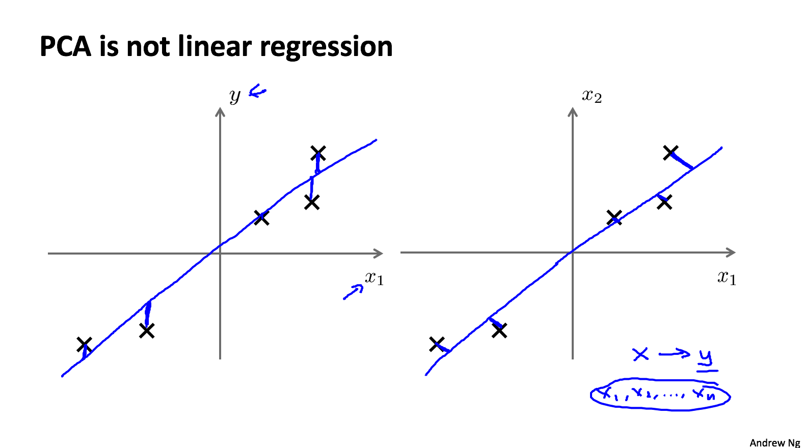

####14.2.2. PCA algorithm

- 【**预处理**】使用PCA前，先对数据进行feature scaling/mean normalization（均值归一化）处理。
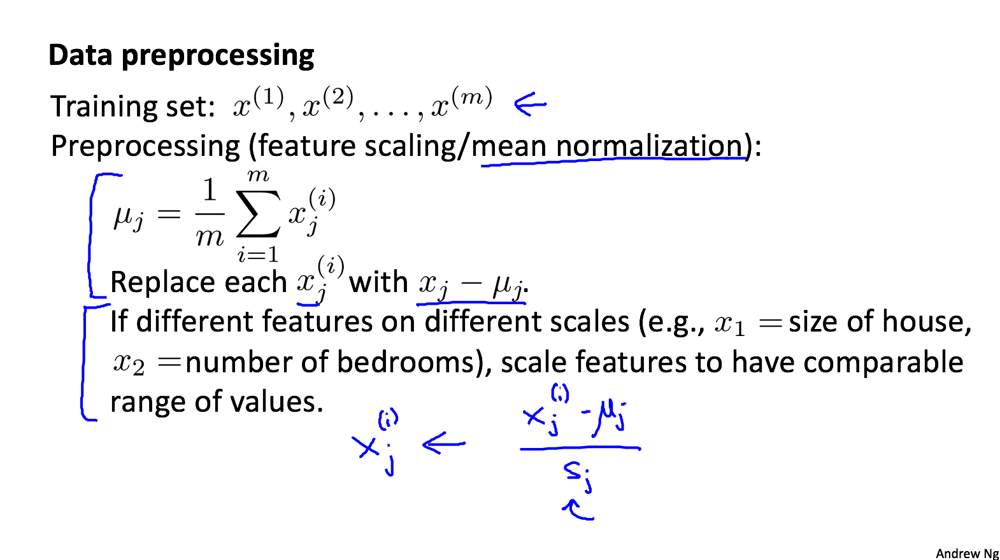
- 【**目标**】PCA中, 我们需要计算的就是向量u和新的特征z. 
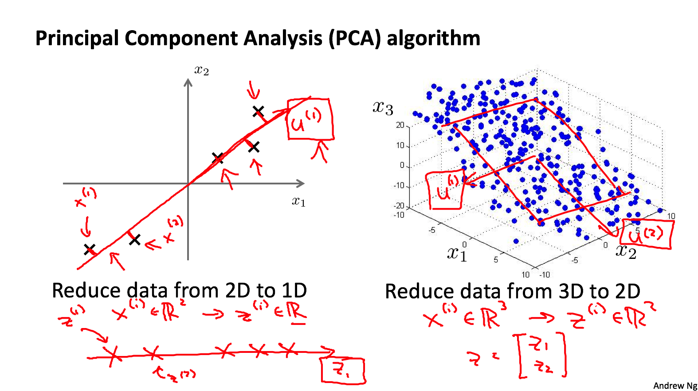

 - 首先计算出数据x的covariance matrixΣ (协方差矩阵)：n*n

 - 然后计算eigenvectors of matrix Σ(Σ的特征向量)。  在Octave里面的方法是：使用奇异值分解(Sigular Value Decomposition, SVD)计算[U, S, V]= svd(sigma) ，其中U和V代表二个相互正交矩阵，而S代表一对角矩阵。

 - [U,S,V]里的U是一个具有与数据之间最小投射误差的方向向量构成的矩阵：n*n。

 - 如果我们需要将数据从n维降到k维, 取U的前k列, 记为\\(U_{reduce}\\).

 - 最后通过如下的方法得到z: \\(Z = U^T_{reduce} * X\\)
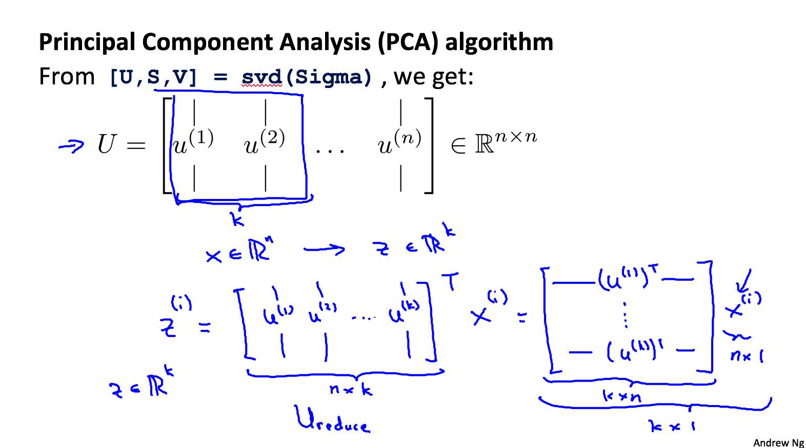

- 总结

###14.3. Reconstruction from compressed representation
数据降维后, 可以通过 \\(z = U_{reduce}^T * x\\) 来的得到原始数据的近似值.

###14.4. Choosing the number of principal components
- 那么该如何选择k的值？一般选择一个最小的k并且满足下图中的公式.
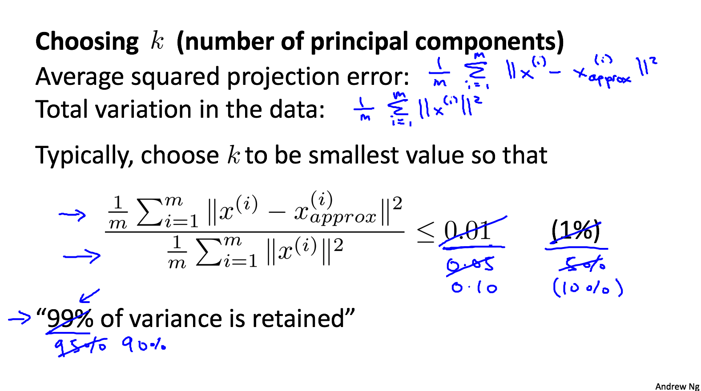
- 我们可以使用下左图中的算法来选择k的值, 但是这样做效率太低；更好的选择是使用下右图中的方法, 在调用一次SVD之后, 我们只需要找到一个最小的k并且满足 \\(\frac {\Sigma\_{i=1}^k s\_i} {\Sigma\_{i=1}^n s\_i} \ge 0.99\\)  即可.

即：

###14.5. Advices for applying PCA
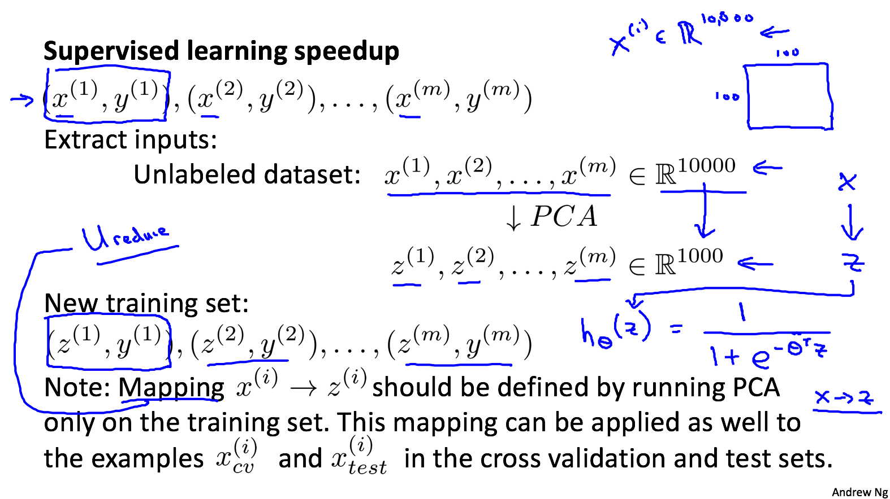
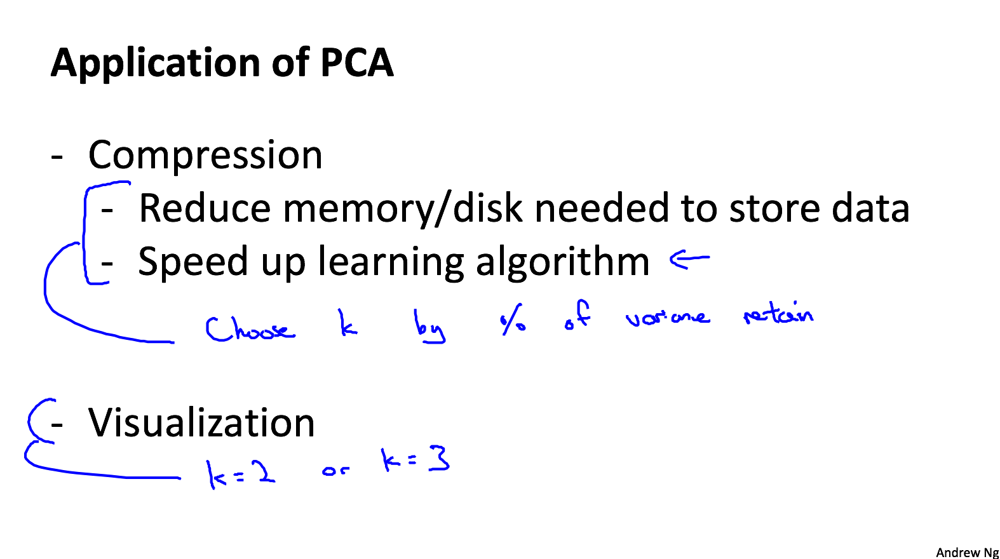
不要用PCA解决过拟合的问题。正确的做法是regularization。
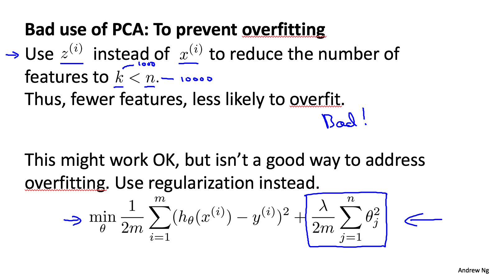
在使用PCA之前应该考虑先使用原始数据, 如果使用原始数据不能达到效果, 再考虑使用PCA.

###解释困惑
- Q1:特征分解和奇异值分解的区别？
- A1:它们都是矩阵分解的方法。矩阵分解的方法有多种：LU分解、特征分解、奇异值分解、QR分解、极分解等。特征分解要求被分解的矩阵为方阵，SVD并不要求要被分解的矩阵为方阵。

- Q2:SVD分解出来的是？
- A2:任何一个m*n矩阵都能进行奇异值分解，拆分为3个矩阵相乘的形式。 \\(A=U *\Sigma * V^T \\)
 - \\(\Sigma\\)的对角线上的元素是奇异值（其余元素0），奇异值的平方也就是\\(AA^T\\)和\\(A^TA\\)的特征值，从大到小排列。
 - U是左奇异，是\\(AA^T\\)的特征向量。在这里用于取前k列。
 - V是右奇异，是\\(A^TA\\)的特征向量。
 - 所以，当我们回到最初，我们想要计算出数据x的covariance matrix Σ (协方差矩阵)的eigenvectors(Σ的特征向量)。  而Σ的公式为：\\(Sigma = 1/m * \Sigma_{i=1}^m(x^{i})(x^{i})^T\\), 而U恰好正是其特征向量。
 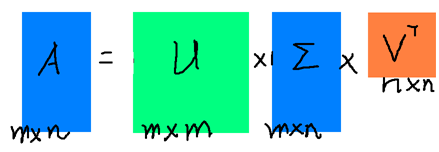
 
- Q3:通俗一点解释特征值，奇异值的意思。
- A3:SVD将数据分解成三个矩阵U，S，VT，其中S是一个对角阵，其中对角元素为奇异值，它代表着矩阵的重要特征，从左上角到右下角重要程度递减。因为奇异值往往对应着矩阵中隐含的重要信息，而且奇异值大小与重要性正相关。比如在补充6里面，matlab图像测试，前50个特征就基本涵盖了原图所有信息。 **特征值矩阵等于奇异值矩阵的平方。** 详见补充4。
 
 ###补充理解：
- 1.[知乎：奇异值的物理意义和几何意义](https://www.zhihu.com/question/- 22237507)
- 2.[机器学习中的数学：特征值和奇异值](https://www.cnblogs.com/LeftNotEasy/archive/2011/01/19/svd-and-applications.html)
- 3.[AMS-SVD-We Recommend a Singular Value Decomposition](http://www.ams.org/publicoutreach/feature-column/fcarc-svd)
- 4.[SVD及应用](https://www.cnblogs.com/pinard/p/6251584.html)
- 5.[知乎：SVD解密](https://zhuanlan.zhihu.com/p/26306568)
- 6.[直观的理解，python实现，应用场合](https://blog.csdn.net/index20001/article/details/73501632)